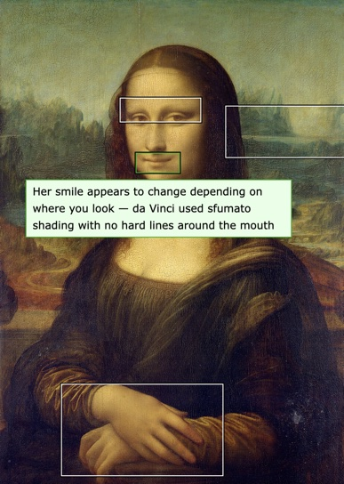

# Annotate Image

<p align="center">
  <a href="https://pullpatchpush.com/annotate-image"></a>
</p>

<p align="center">
  <a href="https://www.npmjs.com/package/annotate-image"></a>
  <a href="https://www.npmjs.com/package/annotate-image"></a>
  <a href="https://bundlephobia.com/package/annotate-image"></a>
  
  <a href="https://www.npmjs.com/package/annotate-image"></a>
</p>

A JavaScript image annotation plugin that creates Flickr-like comment annotations on images. Users can draw rectangular regions on images, add text notes, and persist annotations via callbacks or AJAX.

Works standalone (vanilla JS), or with jQuery, React, or Vue. Framework adapters are tree-shakeable — only the one you import gets bundled.

**[Documentation & Live Demo](https://pullpatchpush.com/annotate-image)**

## Installation

```sh
npm install annotate-image
```

jQuery, React, and Vue are optional peer dependencies. Install only what you use:

```sh
# For jQuery projects
npm install jquery

# For React projects
npm install react react-dom

# For Vue projects
npm install vue
```

## Usage

### Vanilla JS

```html
<link rel="stylesheet" href="dist/css/annotate.min.css">
<script src="dist/core.min.js"></script>
```

```js
const instance = AnnotateImage.annotate(document.getElementById('myImage'), {
  editable: true,
  notes: [
    { top: 286, left: 161, width: 52, height: 37,
      text: 'Small people on the steps',
      id: 'note-1', editable: false },
    { top: 134, left: 179, width: 68, height: 74,
      text: 'National Gallery Dome',
      id: 'note-2', editable: true },
  ],
  onChange(notes) { console.log('Notes changed:', notes); },
});

// Programmatic control
instance.add();              // Enter add-note mode
instance.getNotes();         // Get current annotations
instance.clear();            // Remove all annotations
instance.destroy();          // Tear down completely
```

### ES Modules

```js
import { annotate } from 'annotate-image';
import 'annotate-image/css';

const instance = annotate(document.getElementById('myImage'), {
  editable: true,
  notes: [],
});
```

### jQuery

```html
<link rel="stylesheet" href="dist/css/annotate.min.css">
<script src="https://code.jquery.com/jquery-3.7.1.min.js"></script>
<script src="dist/jquery.min.js"></script>
```

```js
$(function() {
  $('#myImage').annotateImage({
    editable: true,
    notes: [/* ... */],
  });
});

// Destroy
$('#myImage').annotateImage('destroy');
```

Or as an ES module:

```js
import 'annotate-image/jquery';
import 'annotate-image/css';
```

### React

```tsx
import { useRef } from 'react';
import { AnnotateImage } from 'annotate-image/react';
import type { AnnotateImageRef } from 'annotate-image/react';
import 'annotate-image/css';

function App() {
  const ref = useRef<AnnotateImageRef>(null);

  return (
    <>
      <AnnotateImage
        ref={ref}
        src="/photo.jpg"
        width={800}
        height={600}
        editable
        notes={[]}
        onChange={(notes) => console.log(notes)}
        onSave={(note) => console.log('Saved:', note)}
        onDelete={(note) => console.log('Deleted:', note)}
      />
      <button onClick={() => ref.current?.add()}>Add Note</button>
      <button onClick={() => console.log(ref.current?.getNotes())}>
        Get Notes
      </button>
    </>
  );
}
```

### Vue

```vue
<script setup lang="ts">
import { ref } from 'vue';
import { AnnotateImage } from 'annotate-image/vue';
import 'annotate-image/css';

const annotator = ref();
</script>

<template>
  <AnnotateImage
    ref="annotator"
    src="/photo.jpg"
    :width="800"
    :height="600"
    editable
    :notes="[]"
    @change="(notes) => console.log(notes)"
    @save="(note) => console.log('Saved:', note)"
    @delete="(note) => console.log('Deleted:', note)"
  />
  <button @click="annotator?.add()">Add Note</button>
  <button @click="console.log(annotator?.getNotes())">Get Notes</button>
</template>
```

## API Reference

### Core: `annotate(img, options?)`

Creates an annotation layer on an image element. Returns an `AnnotateImage` instance.

#### Options

| Option | Type | Default | Description |
|--------|------|---------|-------------|
| `editable` | `boolean` | `true` | Enable annotation editing |
| `notes` | `AnnotationNote[]` | `[]` | Initial annotations |
| `api` | `AnnotateApi` | — | Server persistence (see below) |
| `onChange` | `(notes: NoteData[]) => void` | — | Called after any notes mutation |
| `onSave` | `(note: NoteData) => void` | — | Called after a note is saved |
| `onDelete` | `(note: NoteData) => void` | — | Called after a note is deleted |
| `onLoad` | `(notes: NoteData[]) => void` | — | Called after notes are loaded |
| `onError` | `(ctx: AnnotateErrorContext) => void` | — | Called on API errors (defaults to `console.error`) |
| `autoResize` | `boolean` | `true` | Re-scale annotations when the container resizes |
| `theme` | `string` | — | CSS theme name; sets `data-theme` on the canvas for variable scoping |

#### `AnnotateApi`

Each field accepts a URL string (default fetch behavior) or a function for full control. Omit `api` entirely for static-only mode.

```typescript
{
  load?: string | (() => Promise<AnnotationNote[]>),
  save?: string | ((note: NoteData) => Promise<SaveResult>),
  delete?: string | ((note: NoteData) => Promise<void>),
}
```

#### Instance Methods

| Method | Returns | Description |
|--------|---------|-------------|
| `add()` | `boolean` | Enter add-note mode. Returns false if already editing. |
| `clear()` | `void` | Remove all annotations. |
| `destroy()` | `void` | Tear down completely. Idempotent. |
| `getNotes()` | `NoteData[]` | Current annotations (internal fields stripped). |
| `load()` | `void` | Rebuild views from the current notes array. |

#### Data Types

```typescript
// Full annotation (includes internal fields)
interface AnnotationNote {
  id: string;
  top: number;
  left: number;
  width: number;
  height: number;
  text: string;
  editable: boolean;
}

// Annotation data passed to callbacks (no internal fields)
type NoteData = Omit<AnnotationNote, 'view' | 'editable'>;
```

### React: `<AnnotateImage>`

#### Props (`AnnotateImageProps`)

| Prop | Type | Default | Description |
|------|------|---------|-------------|
| `src` | `string` | — | Image URL (required) |
| `width` | `number` | — | Image width in pixels |
| `height` | `number` | — | Image height in pixels |
| `notes` | `AnnotationNote[]` | `[]` | Initial annotations |
| `editable` | `boolean` | `true` | Enable editing |
| `onChange` | `(notes: NoteData[]) => void` | — | Notes changed |
| `onSave` | `(note: NoteData) => void` | — | Note saved |
| `onDelete` | `(note: NoteData) => void` | — | Note deleted |
| `onLoad` | `(notes: NoteData[]) => void` | — | Notes loaded |
| `onError` | `(ctx: AnnotateErrorContext) => void` | — | Error occurred |
| `autoResize` | `boolean` | `true` | Re-scale on container resize |

#### Ref Methods (`AnnotateImageRef`)

| Method | Returns | Description |
|--------|---------|-------------|
| `add()` | `void` | Enter add-note mode |
| `clear()` | `void` | Remove all annotations |
| `destroy()` | `void` | Tear down the instance |
| `getNotes()` | `NoteData[]` | Get current annotations |

### Vue: `<AnnotateImage>`

#### Props

| Prop | Type | Default | Description |
|------|------|---------|-------------|
| `src` | `String` | — | Image URL (required) |
| `width` | `Number` | — | Image width in pixels |
| `height` | `Number` | — | Image height in pixels |
| `notes` | `AnnotationNote[]` | — | Initial annotations |
| `editable` | `Boolean` | `true` | Enable editing |
| `autoResize` | `Boolean` | `true` | Re-scale on container resize |

#### Emits

| Event | Payload | Description |
|-------|---------|-------------|
| `change` | `NoteData[]` | Notes changed |
| `save` | `NoteData` | Note saved |
| `delete` | `NoteData` | Note deleted |
| `load` | `NoteData[]` | Notes loaded |
| `error` | `AnnotateErrorContext` | Error occurred |

#### Exposed Methods (via template ref)

| Method | Returns | Description |
|--------|---------|-------------|
| `add()` | `void` | Enter add-note mode |
| `clear()` | `void` | Remove all annotations |
| `destroy()` | `void` | Tear down the instance |
| `getNotes()` | `NoteData[]` | Get current annotations |
| `notes` | `Ref<NoteData[]>` | Reactive current notes |

## Scaling

The plugin automatically detects the rendered image size and scales annotations accordingly. Annotation coordinates are always stored in natural (original) image pixels, so the same data works regardless of display size.

- **CSS constraints** (e.g., `max-width: 500px`) are respected automatically
- **HTML size attributes** (e.g., `width="400"`) work as expected
- **Responsive layouts** are supported via `ResizeObserver` — annotations reposition when the container resizes
- Set `autoResize: false` to disable dynamic resizing (annotations scale once at initialization)

```js
// Works automatically — no configuration needed
annotate(document.getElementById('myImage'), {
  notes: [/* coordinates in natural image pixels */],
});

// Disable dynamic resizing
annotate(document.getElementById('myImage'), {
  autoResize: false,
  notes: [/* ... */],
});
```

## Theming

The plugin uses CSS custom properties for all visual styling. Override these variables in your CSS to create custom themes.

### Using the `theme` option

Set `theme` in options to add a `data-theme` attribute to the canvas element, enabling CSS scoping:

```js
annotate(document.getElementById('myImage'), {
  theme: 'dark',
  notes: [/* ... */],
});
```

```css
.image-annotate-canvas[data-theme="dark"] {
  --image-annotate-area-border: rgba(255, 255, 255, 0.7);
  --image-annotate-area-bg: rgba(100, 149, 237, 0.15);
  --image-annotate-note-bg: #2a2a3e;
  --image-annotate-note-text: #e0e0f0;
  --image-annotate-note-radius: 4px;
  --image-annotate-note-shadow: 0 2px 8px rgba(0, 0, 0, 0.4);
  /* ... see demo for full example */
}
```

Multiple instances on the same page can use different themes.

Button icons (save, delete, cancel) use CSS `mask-image`, so their color automatically follows `--image-annotate-button-text`. Dark themes just need to set the text color — no icon overrides required.

### Available CSS variables

Set on `.image-annotate-canvas`:

| Variable | Default | Description |
|---|---|---|
| `--image-annotate-canvas-border` | `none` | Border around the canvas |
| `--image-annotate-font-family` | `Verdana, sans-serif` | Font for notes and buttons |
| `--image-annotate-font-size` | `12px` | Font size for notes and buttons |
| `--image-annotate-area-border` | `#000` | Annotation rectangle border color |
| `--image-annotate-area-inner-border` | `#fff` | Annotation inner border color |
| `--image-annotate-area-bg` | `transparent` | Annotation rectangle fill |
| `--image-annotate-area-border-width` | `1px` | Annotation border thickness |
| `--image-annotate-area-border-style` | `solid` | Annotation border style |
| `--image-annotate-area-radius` | `0` | Annotation border-radius |
| `--image-annotate-hover-color` | `yellow` | Hover border color (read-only) |
| `--image-annotate-hover-editable-color` | `#00ad00` | Hover border color (editable) |
| `--image-annotate-hover-bg` | `transparent` | Hover background fill |
| `--image-annotate-note-bg` | `#e7ffe7` | Tooltip background |
| `--image-annotate-note-border` | `#397f39` | Tooltip border |
| `--image-annotate-note-text` | `#000` | Tooltip text color |
| `--image-annotate-note-radius` | `0` | Tooltip border-radius |
| `--image-annotate-note-shadow` | `none` | Tooltip box-shadow |
| `--image-annotate-note-max-width` | `300px` | Tooltip max width |
| `--image-annotate-edit-bg` | `#fffee3` | Edit form background |
| `--image-annotate-edit-border` | `#000` | Edit form border |
| `--image-annotate-edit-radius` | `0` | Edit form border-radius |
| `--image-annotate-edit-shadow` | `none` | Edit form box-shadow |
| `--image-annotate-edit-max-width` | `300px` | Edit form max width |
| `--image-annotate-button-bg` | `#fff` | Button background |
| `--image-annotate-button-bg-hover` | `#eee` | Button hover background |
| `--image-annotate-button-border` | `#ccc` | Button border |
| `--image-annotate-button-text` | `#000` | Button text and icon color |
| `--image-annotate-add-bg` | `rgba(0,0,0,0.4)` | Add Note button background |
| `--image-annotate-add-bg-hover` | `rgba(0,0,0,0.6)` | Add Note button hover background |
| `--image-annotate-add-border` | `1px solid rgba(255,255,255,0.5)` | Add Note button border |
| `--image-annotate-add-radius` | `4px` | Add Note button border-radius |

## Tree Shaking

Each entry point (`annotate-image`, `annotate-image/jquery`, `annotate-image/react`, `annotate-image/vue`) is a separate bundle. Importing one does not pull in the others. Unused framework adapters are excluded automatically by bundlers that support package `exports`.

## Error Handling

The `onError` callback receives a context object:

```typescript
interface AnnotateErrorContext {
  type: 'load' | 'save' | 'delete';
  error: Error;
  note?: AnnotationNote;
}
```

If no `onError` callback is provided, errors are logged to the console.

## Accessibility

The plugin supports keyboard navigation:

- **Tab** to navigate between annotation areas and controls
- **Enter/Space** to activate buttons and open editable annotations
- **Escape** to cancel editing
- Annotation areas and buttons have `role="button"` and `tabindex` attributes
- Focus is managed automatically when entering/exiting edit mode
- Visible focus styles on all interactive elements

## Demos

Try the [live examples](https://pullpatchpush.com/annotate-image/examples) online, or run the demo server locally:

```sh
npm run demo
```

This opens a browser at `http://localhost:8080/demo/index.html` with links to demos including static annotations, AJAX loading, vanilla JS, React, Vue, multiple instances, and CSS theming.

## Build

```sh
npm install
npm run build        # Type-check, bundle, minify
npm run build:check  # Type-check only
npm test             # Run tests
npm run test:jquery4 # Run tests against jQuery 4
```

### Build Output

`dist/` contains the built artifacts:

- `dist/core.js` — Core library (ESM, no dependencies)
- `dist/core.min.js` — Core library (IIFE, minified, `AnnotateImage` global)
- `dist/jquery.js` — jQuery adapter (ESM, jQuery external)
- `dist/jquery.min.js` — jQuery adapter (IIFE, minified, jQuery external)
- `dist/react.js` — React component (ESM, React external)
- `dist/vue.js` — Vue component (ESM, Vue external)
- `dist/css/annotate.min.css` — Minified styles
- `dist/types/` — TypeScript declaration files

## Browser Compatibility

All modern browsers (Chrome, Firefox, Safari, Edge). The plugin uses pointer events and `fetch`, so IE is not supported.

## History

### Version 2.0

* Package renamed from `jquery-image-annotate` to `annotate-image`
* Rewritten in TypeScript with vanilla DOM internals
* Removed jQuery UI dependency — drag/resize uses vanilla pointer events
* Added core vanilla JS API (`annotate()` factory) that works without jQuery
* jQuery adapter is now a thin wrapper registering `$.fn.annotateImage`
* Added React 18+ and Vue 3+ framework components
* Lifecycle callbacks: `onChange`, `onSave`, `onDelete`, `onLoad`
* `getNotes()` method for reading current annotations
* Replaced `$.ajax`/`$.getJSON` with `fetch`
* Build system replaced: Bower/Grunt removed in favor of npm/esbuild
* Added ESM and IIFE bundle outputs with TypeScript declarations
* Supports jQuery 3.x and 4.x
* Keyboard accessibility for all interactive elements
* Full test suite using Vitest

### Version 1.4 — 19th January, 2011
* Upgraded jQuery to version 1.7.1

### Version 1.3 — 22nd June, 2009
* Fixed a bug when creating a new annotation via AJAX.
* The Id of the annotation is expected to be returned as a JSON object from the response of the save call, e.g.

    `{ "annotation_id": "000001" }`

### Version 1.2 — 24th April, 2009
* Fixed jQuery UI 1.3.2 compatibility.
* Forked source for jQuery 1.2.x and 1.3.x
* Notes now fade in/out.
* Tidied up CSS/positioning.

### Version 1.1 — 2nd April, 2009
* Fixed bug when annotating an image with no previous annotations.

### Version 1.0 — 11th March, 2009
* Initial release

## Credits

Based on the Drupal extension:

Image Annotations by Ronan Berder
hunvreus@gmail.com
http://drupal.org/project/image_annotate

## Licence

Released under the [GNU GPL v2](LICENSE) license.
